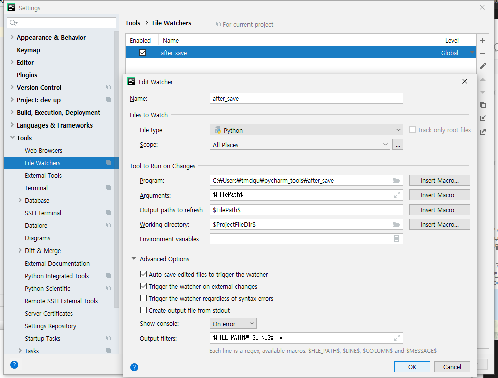

# DEV-UP

## 패키지 설치
```bash
pip install -r requirements.txt
```

## VSCode 설정
`Python` 과 `RunOnSave` extension을 설치해주세요
`.vscode` 폴더안에 `settings.json` 안에 다음과 같은 내용을 써주세요
이미 내용이 있다면 추가시키세요

```javascript
{
    "[python]": {
        "editor.formatOnSave": true,
        "editor.formatOnPaste": false
    },
    "python.linting.mypyEnabled": true,
    "python.linting.flake8Enabled": true,
    "runOnSave.commands": [
        {
            "match": ".*\\.py$",
            "notMatch": "[\\\\\\/]_[^\\\\\\/]*\\.py$",
            "command": "isort ${file}",
            "runIn": "backend",
            "runningStatusMessage": "Sortimg imports",
            "finishStatusMessage": "Sorted imports"
        }
    ]
}
```

## 파이참 설정법

파이참은 좀 귀찮습니다.
아무 폴더나 다음과 같은 `.bat` 파일이나 `.sh`로 만들어주세요. 

```bash
#!/bin/sh
isort $1
autopep8 --in-place --aggressive $1
flake8 $1
```
리눅스 같은 경우 `chmod +x` 로 권한을 주세요

PyCharm  Preference -> External Tools -> FileWatcher -> Global로 하나 만들고 아래처럼 만들어주세요.
